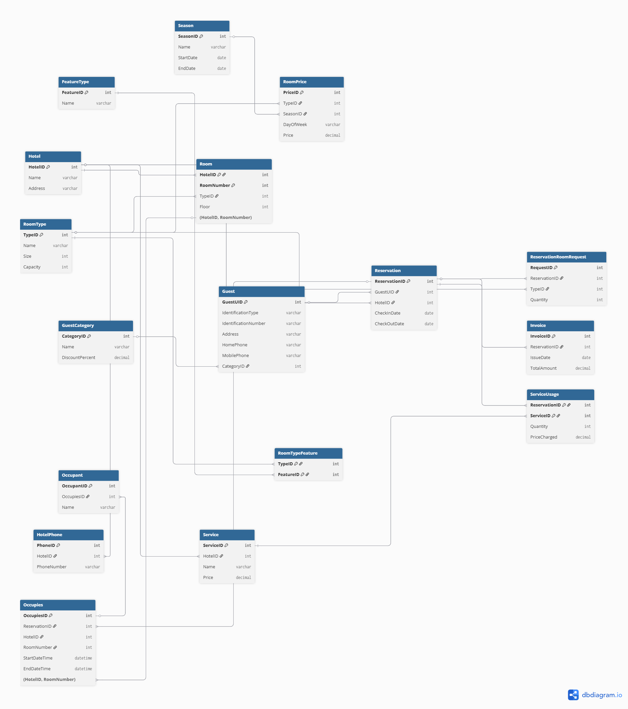

# CS374 Hotel Database Final Report
*Patrick Buehlmann & Caiden Dunn*

## ER Model: 

## Relational Model:

## Database Creation:
- Drop tables: [drop.sql](./database/drop.sql)
- Create tables: [create.sql](./database/alter.sql)
- Add constraints to tables: [alter.sql](./database/alter.sql)

## Data:
Add some data from using Python Faker - 

## Queries: 
### Query One -
A new guest would like to reserve a room in Hotel A from July 15th (check-in) to July 17th (check-out). The guest qualifies as a VIP customer. The select query should return all the different room types that are available in the hotel for those two nights, along with be the average cost per night for that room type (cost per night divided by # of nights). The cost per night must take into account the current season and the days of the week of the requested dates of stay, along with any special rates for gold customers.
The insert queries should insert the new guest and reserve one room of one of the available room types for the guest on their desired dates in the desired hotel.
There must be data in the tables such that there is at least one room type that is not available on the requested day(s), and the room price must vary across the 2 days due to the day of the week. You may assume that the whole day period falls fully within one season. The selected customer category must change the overall price.

### Query Two - 
Mr. and Mrs. Smith arrive at Hotel B in the late afternoon on the day of their reservation. They have previously reserved a room type double. In order to give the Smiths their room, the desk clerk needs to find an appropriate room. The select query should list all the room numbers of double rooms that are currently unoccupied. The insert quer(ies) should assign the room, assuming Mrs. Smith is the guest who made the reservation, and Mr. Smith an occupant who was not previously in the database.
This query should assume the reservation for Mrs. Smith already exists in the database. There should be at least 1 room of the reserved room type that is already occupied and is not returned as an available room.

### Query Three - 
Two nights have passed, and Mr. and Mrs. Smith are ready to check out. Write a query to generate the billing statement for Mrs. Smith. An insert query should insert at least one charge to the reservation for whatever extra service you have modeled in your database. A select query should return the date range, room type, extra feature(s) and total cost for the whole stay. The room price must not be the same on every night of the reservation, but the reservation must fall fully within one season. 
Mrs. Smith should belong to a guest category that changes the price of the reservation. Insert/update query(s) should "check out" the Smiths from the room and record anything required for the way you store billing history.

### Query Four - 
Write a query to find the names of the occupants and the person that reserved the room for a specific room on a specific date. 
There should be data in the database such that this query will return at least 2 people (the reserver and at least 1 occupant).

### Query Five - 
For a guest who has made at least 2 reservations in at least 2 different hotels in the chain during a year, write a quer(ies) to find the total amount of money spent by the guest at the chain during a given one-year period.
